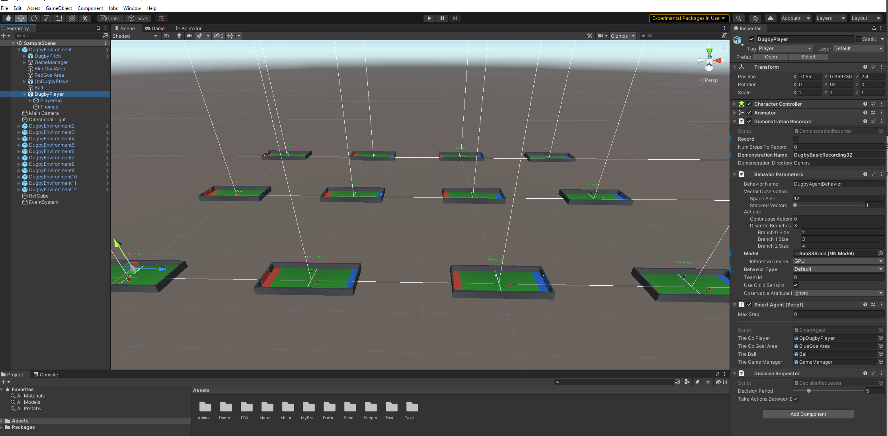

# DugbyML
Training of an Unity ML Agent to Play the Game of Dugby
Dugby is a Two Player game, with the objective of the players to score either hand carried ball Tries or Kicked balls into oponents Goal area. 

## Overview ##
An Overview of the Dugby Agent training process and its typical performance can be found on YouTube 
[Dugby ML Agenst Training YouTube](https://www.youtube.com/watch?v=2uu0Arl6IMc)

## Environment and Agent Design ##

The Blue Agent is scripted as per the SmartAgent.cs script, which processes the following Observations, Actiosn and Rewards. 
Observations: 
  - (float) Orientation around Vertical
  - (float) Relative X,Z vectors to Opposite Goal
  - (float) Relative X,Z Vectors to Ball
  - (float) Relative X,Z Vectors to opposite Player (Red)
  - (float) Discretes, Has Ball, Oponent Has Ball, Conditionals Ability to Kick, Pickup and Tackle  - These booleans are Hot Encoded into (-1.0f,+1.0f) floats

There are no use of RayCast observation sensors. So the Total Observation shape is then 12x floats, with no Observaitonal Stacking. 

Blue Agent Available Actions:
  - Branch[0] : NOOP, Move Forward
  - Branch [1]: NOOP, Rotate Left, Rotate Right
  - Branch[2] : NOOP, Pickup Ball, Kick Ball, Tackle Player

So an Actions Branch Shape of (2, 3, 4) 

Dugby Environment Rewards Profile: 

  -     +2.0 for a Try and +1.0 for a Kicked Goal 
  -     -2.0 for a Red Try or Red Goal
  -     -1.0/Max Steps for each Step without Ball, -0.5/Max Steps With Ball, -2.0/Max Steps if Opposition Player has Ball 
  
  

In the DugbyML Package provided in above, it will be seen that there is a Prefab of a DugbyML environment, consisting of a Dugby Game Manager, Ball, (Red)Opposition Player, (Blue) ML Agent Player and the Pitch Area, with its associated colliders and Goal areas.  This Prefab is utilsed to set up a Training Envionment of 12 x Dugby Game environments.

## Performance and Observations  ##

This took a lot of frustrating meandering around Hyperparameter experimentation and tuning to discover any reasonably performant configurations. There is very little intuition on what works, and doesn't on all these hyper parameters.  I had initially used stacked observations, for some implied velocity insights. (Making a Total of 36 float Observations at one point)  Based upon intuition that my programmed Red Oponent did not make any use of velocities, and operated purely upon Relative positions and vector.dot directional checks. I removed the stacked Observations.

I note that it takes a long time on lesson 1, just to learn the objective of scoring Tries. (c.f.: Approach the Ball, Pick it Up, and Travel into the oponents goal Area). This took around 200-400k training steps, even with a GAIL demonstration file on this. The Agent did not appear to make such significant use of the Imitation learning as I was expecting. The initial Agent behaviour was still pretty random, regardless of the GAIl strength value.  I also tried to use Behavioural Cloning, but the Agent still did not appear to learn to follow the basic demonstrations.  

I experimented with different Decsion Requester periods from the default 5 setting, since I am still rather confused on its actual meaning. (The Unity ML Agents documentation is Not clear the use of this setting, or any intution behind it) I tried witha  setting of Decision period = 1, I preusme every Action is requested of the Nueral Network Brain. But this simply makes Training much slower, with evry action, seeming to cause a neural network its training update. So I returned to the default of 5.    

I  had to introduce hot encoding of AbleToPickup, AbleToKick, AbleToTackle, to help influence, as a big hint towards the Agent to then invoke the corresponding Action decisions. This feels like a bit of a cheat, and rather like hot coding of the actions to be taken. But found that these explicit observations were required for any possible training.  

I got some real training success when I decided to split the Action Branch froma  single Actions Branch into three Branches. One for Forward Motion, One For Rotation, and another for Play Actions. This along with the Hot Encoding of the ability conditionals made a dramatic improvement on the abilty to learn the basic performance. So it would appear that orthogonal Actions should be partitioned out. 

I tried with and without curiosity. Experience suggests the use of the Curiosity ICM in sparse reward environments. So typically use. I found that I do need some curiosity, but have been warned to set the Intrinsic strength to very low values, so as not to swamp the explicit environmental rewards.   

See the DugbyMLConfi.yaml file for the exact details of the final configuration. 

The final behaviour remains rather erratic, even after 20 Million epoch training steps.  There are quite a few behaviour modes of "Benny Hill" type chasing around the oponent, up to the opponents gaol, then turning aorund to do a circuit around the oposition player, instead of going for a Try.  This may be due to a willimgless to hold onto the ball, which has a reduced per step penalty. 

I note that the agent (hardly) never makes use of any kick actions.  The Try Rewards are significantly higher than a kicked Goals. But in manual play, a kicked ball is a good tactic to avoid being immeadiatly tacked again. (n.b. The Opposition player is programmed to make use of probabilistic kicks, if the Blue player is close, and facing the gola direction, and during games can be seen to use this action.)   

## Download and Use ##

I have captured and export a Unity Package of my Dugby Game Scene, Scripts, Models etc. I am not so familiar with Unity Package export/ imports, so hopefully this is the most convinient way to import into your Unity Projects.  This can be downladed and imported into Unity, or possibly via the Unity Git import directly by refernce to the .json file from the Unity Package Manager.  You will also need to import the Unity ML Agents package to run this, andpossibly textMeshPro for the Display Score Graphics. (Note this was developed and Tested using Release 18)

I have included the Run33Brain.onnx into the Blue Agents configuration. So the final Perfomance should be visible upon Unity Game Runs. Note However that you will have to change the Game Difficulty within the SnartAgent.cs script to demonstrate perfomance at the different Training lessons. Since by default the Game Difficulty is read in from the Acadamy.Instance.Environmental Parameters within every Episode Begin() call. So these calls can be commented out to see performance at different Training Levels. 

The DugbyMLConfig File has been included as a reference how the Agent is Trained through the use of GAIL  Imitation learning, and Curriculum Learning through a set of Lesson Levels.  The Agent code is also explicitly provided here to understand the Observations, Actions and Rewards details. 

## Acknowdelements ## 

- Unity ML Agents at:  https://github.com/Unity-Technologies/ml-agents
- Imphenzia : Blender Modelling Support: https://www.youtube.com/c/Imphenzia
- Jason Weimann: Unity and Game Development: https://www.youtube.com/c/Unity3dCollege
- Immersive Limit: Unity Machine Learning Agents: https://www.youtube.com/c/ImmersiveLimit

